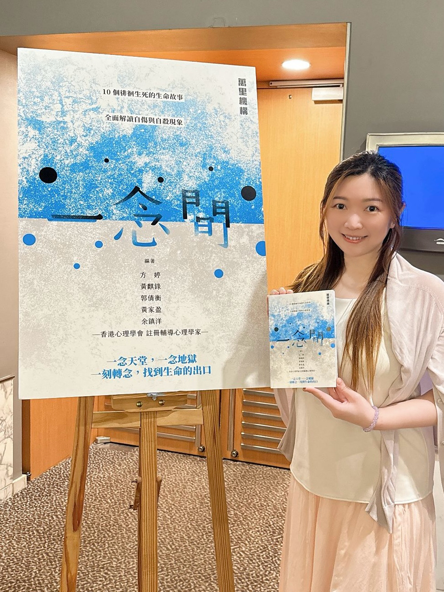

  
  

    <h2 style="margin:0 0 0.5rem 0;">你好，我是 Shirley</h2>
    
我是黃家盈，香港心理學會（HKPS）註冊輔導心理學家，現正修讀輔導心理學博士。

    
入行從來不是因為一個宏大的理想。當年其中一個選修科讀到心理學，覺得這科目適合自己，便一路走下去。做著做著，卻漸漸發現，原來自己也喜歡在一個真誠的空間裡與人對話，見證彼此的成長。這份發現，讓我留下來。

  

---

## 我的理念

我相信，每個人都需要一個完全屬於自己的空間，一個可以安心接觸平日不敢靠近的情緒、慢慢認識自己的地方。能夠見證這個過程，是這份工作最珍貴的時刻。

多年來，我也越來越意識到，香港的助人專業發展蓬勃，不同專業各有所長。我希望能透過自己的工作，讓更多人了解輔導心理學家的角色與價值。

我相信，輔導工作需要持守專業操守，並不斷學習與自我反思。只有這樣，才能真正幫助到每一個來到這個空間的人。

---

## 專業資歷

- 香港心理學會註冊輔導心理學家
- 亞洲專業輔導及心理學會註冊臨床督導
- 亞洲專業輔導及心理學會註冊輔導員
- 輔導心理學博士（修讀中）

---

## 專業培訓

- Emotionally Focused Individual Therapy (EFIT) Essentials
- Core Skills Advanced Training in Emotionally Focused Couple Therapy
- Professional Certificate in Clinical Supervision of Counselling

---

## 工作範疇

- 個別及小組輔導\
- 心理評估\
- 為輔導及社會服務專業人員提供臨床督導及專業培訓\
- 大專教學\
- 學術研究

---

## 媒體

曾參與RTHK電視節目示範兒童輔導工作。

---

