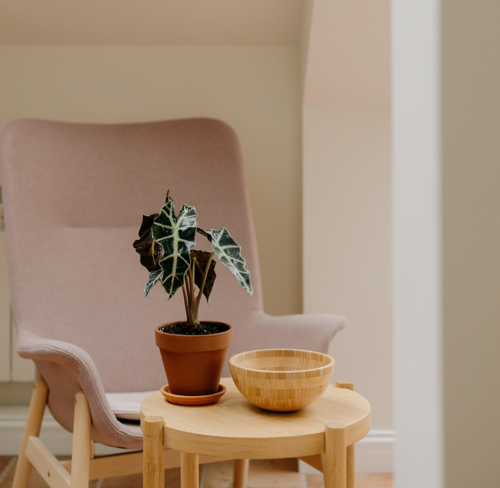

你好，我是一位香港註冊輔導心理學家。

超過十年的臨床經驗，我陪伴過不同年齡的人，從年幼的孩子、掙扎中的青少年，到面對人生轉折的成年人，走過情緒的幽谷，重新找到自己的方向。

我相信每個人都有能力成長，只是有時候需要一個安全的空間，和一個願意聆聽的人。

---

## 我的專業範疇

  🧒 兒童及青少年心理
  💛 情緒輔導
  🌱 生涯規劃與自我探索
  👨‍👩‍👧 親職諮詢
  🎓 輔導督導與培訓

---

## 我的著作

我曾參與撰寫多本心理學大眾讀物，希望將輔導知識帶入日常生活。

👉 [查看所有著作](著作)

---

## 社交平台

Instagram｜ [@shirley.counsellingpsy](https://www.instagram.com/shirley.counsellingpsy)